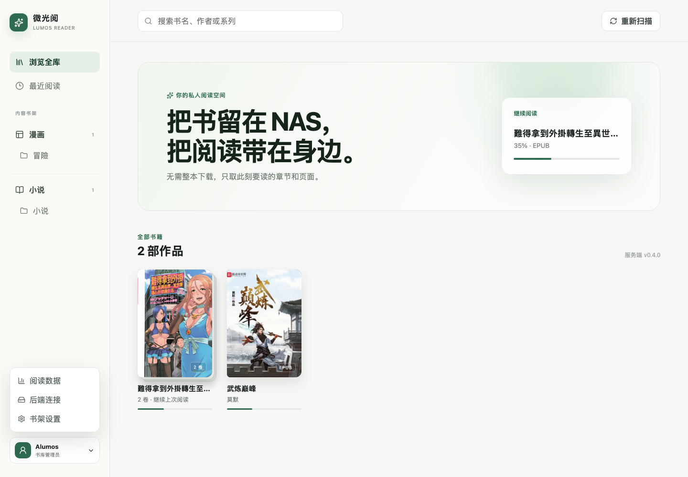
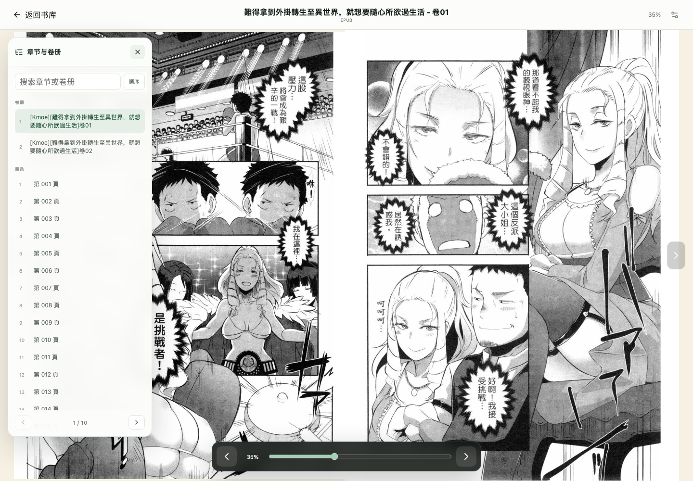

# 微光阅 · Lumos Reader

把 NAS 里的 EPUB、MOBI、AZW3、PDF、CBZ 和 TXT 作为只读书库，通过 Web 在线阅读。服务端是一个 Go 进程，Web 构建产物内嵌其中，SQLite 只保存进度、阅读时长和书架配置。



窄屏布局见 [docs/preview-mobile.png](docs/preview-mobile.png)。



目前支持：

- EPUB 元数据与内嵌封面识别，CBZ 首图封面，以及 PDF、MOBI、AZW3 的浏览器端懒加载封面。
- EPUB、MOBI、AZW3 分页阅读；PDF 与 CBZ 在线分页；TXT 基础排版。阅读区默认全屏，中部点击可打开返回书库、书名、章节、进度和翻页控制。
- 网文、文学、墨水屏、漫画和夜间模板，以及用户自定义模板、字体文件、字号、行距、段距、字距、页面颜色、单双页、翻页效果和可隐藏翻页键。
- 字体上传到服务端字体目录并实时列出，Web 和 Android 客户端可按需下载同一字体。
- 侧栏按漫画、图书分组，再依据挂载目录折叠书架和二级分类；书架设置可指定内容类型，并实时展开完整 NAS 目录树。
- 固定版式 EPUB/CBZ 自动识别为漫画，并读取 EPUB 原生左右翻页方向；阅读方向也可手动覆盖。
- 漫画保持后续 20 页的内存预加载窗口；方向键及浏览器允许上报时的音量键均可翻页。
- 阅读进度、“最近阅读”和按日阅读时长统计。书籍内容支持 HTTP Range，请求多少读多少，不会先把整本书下载到缓存。

## 本地预览

```bash
cd web
npm install
npm run build
cd ..
mkdir -p library
go run .
```

把测试书放入 `library` 后打开 <http://127.0.0.1:8080>。本地预览默认未设置密码。

## Docker Compose

```bash
cp .env.example .env
# 编辑 .env 中的密码、漫画/图书路径和 NAS 用户 UID/GID
mkdir -p data
docker compose pull
docker compose up -d
```

仓库中的 [compose.yaml](compose.yaml) 就是可直接使用的双目录 NAS 示例：

```dotenv
COMICS_DIR=/volume5/漫画
BOOKS_DIR=/volume4/小说
STATE_DIR=./data
ADMIN_PASSWORD=请换成强密码
PUID=1000
PGID=1000
```

两个来源会分别只读挂载为 `/library/漫画` 和 `/library/小说`，后端仍只扫描一个统一根目录。首次打开“书架设置”后，可把 `漫画` 目录设为漫画、`小说` 目录设为图书；各自下面的完整层级会实时显示。数据库和上传字体统一保存在 `STATE_DIR`（字体位于 `STATE_DIR/fonts`）。

Compose 默认只监听 `127.0.0.1:8080`，请通过 NAS 自带反向代理、Caddy、Nginx Proxy Manager 或 Traefik 提供 `https://read.alumos.cn`。容器根文件系统和两个书库挂载均为只读，并移除了全部 Linux capabilities。

镜像由 GitHub Actions 在每次推送到 `main` 后自动发布为 `ghcr.io/alumos/lumosreader:latest`，同时提供 `linux/amd64` 和 `linux/arm64`。如果 GHCR 包仍为私有，需要先在 NAS 登录：`docker login ghcr.io`。

## 在线读取原理

- EPUB、MOBI、AZW3 使用 HTTP Range 和一个兼容 `File.slice()` 的远程文件对象，解析器只请求目录、当前章节和当前图片所需的字节范围。
- PDF.js 以 64 KB Range 分块读取交叉引用和当前页面，并关闭自动预取。
- CBZ 由服务端读取 ZIP 目录，客户端逐页请求 `/pages/{page}`，并在内存中预加载后续 20 页，不会先传整个压缩包。

服务端始终直接读取只读挂载并写入响应，不创建书籍副本或页面缓存目录。正文 Range、漫画页和漫画目录响应均使用 `Cache-Control: private, no-store`；阅读器只保留当前版面和后续 20 页的短期内存，退出阅读器时释放。体积很小且会反复显示的封面、字体保留一天浏览器缓存。

因此打开书不会下载全本，也不需要在章节结束时再清理持久缓存；读完整本后累计流量自然可能接近整本大小，但不会在服务端、浏览器存储中再生成一份完整书籍。

## 服务端发现

Android 客户端只需保存服务端根地址。`GET /api/server` 会返回 API 版本、认证要求和支持格式；登录后从 `GET /api/books` 获取书库。

当前 API 版本为 v4。书库文件只读，封面、正文和字体均通过同一服务端地址提供；字体列表和下载地址由 `GET /api/fonts` 返回，后续 Rust Android 客户端不需要直接连接 NAS。
